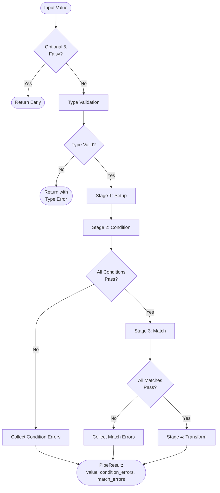
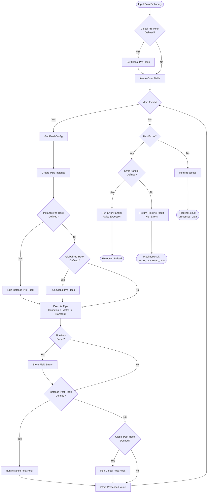

# Introduction


**Hetman Pipeline** is a flexible, developer-centric validation engine. It is built for those who prioritize deep customization and want to manage validation, matching, and transformation logic in one centralized location.

## Installation

```bash
pip install hetman-pipeline
```

---

## Core Concepts

The architecture is divided into two main layers:

| Component    | Level  | Responsibility                                                        |
| ------------ | ------ | --------------------------------------------------------------------- |
| **Pipe**     | Field  | Processes a single value through validation and transformation steps. |
| **Pipeline** | Object | Orchestrates multiple Pipes to validate an entire data dictionary.    |

---

## The Pipe Lifecycle

Each Pipe follows a strict, sequential four-stage execution flow. This "fail-fast" approach ensures that transformations only occur on data that has already been verified.



### Stage Details

1. **Setup** - Prepares data using transform handlers (e.g., Strip whitespace) before validation
2. **Condition** - Validates data integrity (type, size, range)
3. **Match** - Validates content format (regex, patterns)
4. **Transform** - Modifies and normalizes data after successful validation

!!! note "Hooks are Pipeline-Level"

    Individual Pipes don't have hooks. Hooks (pre_hook, post_hook) are defined at the **Pipeline** level and execute before/after each Pipe runs.

!!! tip "Setup vs Pre-Hook"

    While `pre_hook` can perform the same data preparation as `setup`, the `setup` argument is a **developer-friendly simplification**. Key differences:

    - **Scope**: `setup` is **per-pipe** (defined individually for each field), while `pre_hook` is **global** (applies to all pipes in a Pipeline)
    - **Use `setup`** for: Simple, field-specific transformations (like stripping whitespace from a specific field)
    - **Use `pre_hook`** for: Global logic that applies to all fields, or complex custom logic

!!! info "Condition Loop Behavior"

    **Within a single Pipe:**

    - By default, **all conditions are checked** even if one fails
    - Some conditions have `BREAK_PIPE_LOOP_ON_ERROR` flag (e.g., `ValueType`)
    - When a condition with this flag fails, **remaining conditions are skipped**
    - This prevents unnecessary checks (e.g., checking string length when value isn't a string)

    **Example:**
    ```python
    # If ValueType fails, MinLength won't be checked
    Pipe(
        value=123,  # Not a string!
        type=str,
        conditions={
            Pipe.Condition.MinLength: 5  # Skipped because ValueType failed
        }
    )
    ```

!!! info "Pipeline Field Processing"

    **Pipeline always processes ALL fields:**

    - Even if one field fails validation, Pipeline continues to the next field
    - Even if a condition has `BREAK_PIPE_LOOP_ON_ERROR` flag, it only affects that specific Pipe
    - This ensures you get **complete validation feedback** for the entire data dictionary

    **Example:**
    ```python
    # Both fields will be validated, even if 'email' fails
    Pipeline(
        email={"type": str, "matches": {Pipe.Match.Format.Email: None}},
        age={"type": int, "conditions": {Pipe.Condition.MinNumber: 18}}
    ).run(data={
        "email": "invalid",  # Will fail
        "age": 16            # Will also be checked and fail
    })
    # Result will contain errors for BOTH fields
    ```

---

## Pipeline Orchestration

The Pipeline orchestrates multiple Pipes to validate an entire data dictionary:



### Hook Priority

-   **Instance hooks** (defined on pipeline instance) take precedence over **global hooks** (defined on Pipeline class)
-   Hooks can modify values using `hook.value.set(new_value)`
-   Post-hooks have access to validation status via `hook.is_valid`

---

## Technical Features

!!! abstract "Why use Hetman?"

    -   **Centralized Logic:** Keep your validation rules and data cleaning in one schema.
    -   **Extensible:** Highly customizable pipes for unique business requirements.
    -   **Developer Experience**: Easily add your own handlers and modify existing ones.

!!! example "Simple Pipe Logic"

    ```python

    from pipeline import Pipe

    result = Pipe(
        value="john.smith@example.com",
        type=str,
        conditions={Pipe.Condition.MaxLength: 64},
        matches={
            Pipe.Match.Format.Email: None
        },
        transform={
            Pipe.Transform.Reverse: None
        }
    ).run()

    print(result)
    # PipeResult(value='moc.elpmaxe@htims.nhoj', condition_errors=[], match_errors=[])
    ```
